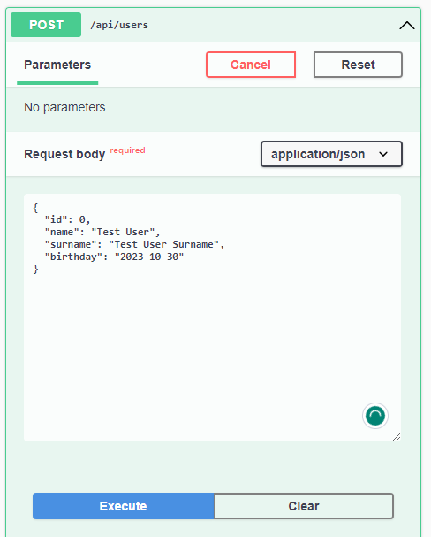
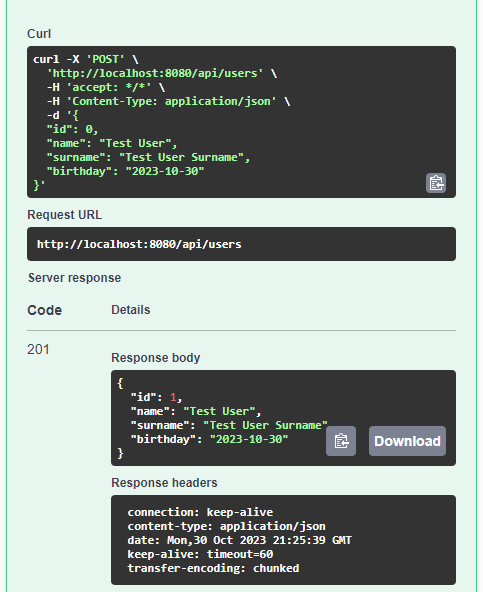
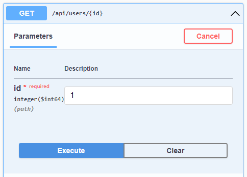
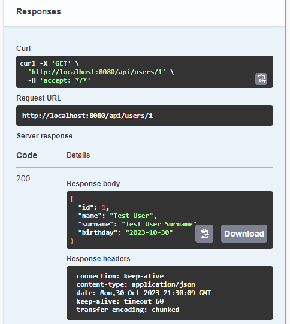
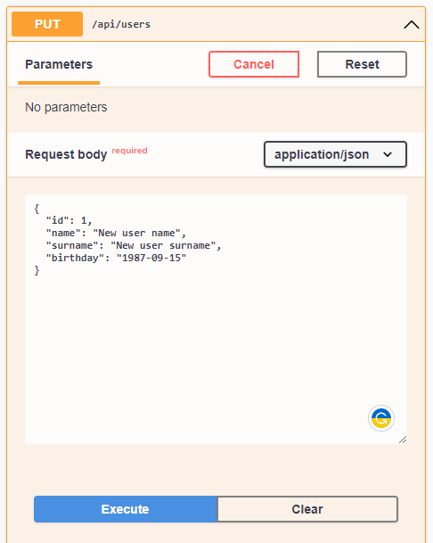
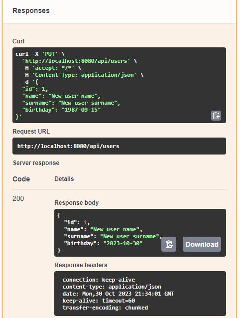
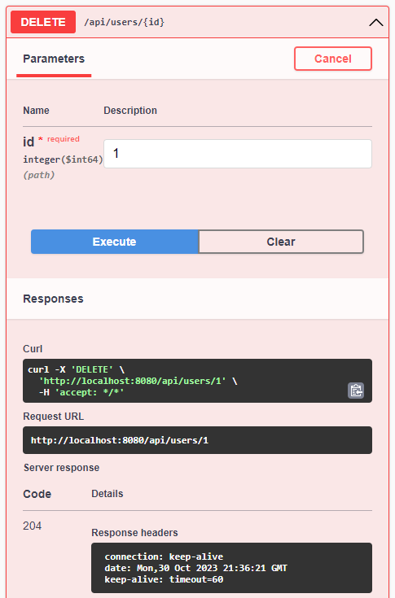

# JABS-REST

This is example of REST API Architecture. Application consists of 4 maven modules:
1. jmp-dto
2. jmp-service-api
3. jmp-cloud-service-impl
4. jmp-service-rest

[jmp-dto](jmp-dto) stores DTO and Entity models. [jmp-service-rest](jmp-service-rest) has interfaces of controllers.
[jmp-service-api](jmp-service-api) has interfaces of services. [jmp-cloud-service-impl](jmp-cloud-service-impl) consists of
actual implementation of services and controllers. 

Application shows implementations of REST APIs according to all Richardson Maturity Level (0 - 3):

* 0: [UserControllerL0](jmp-cloud-service-impl%2Fsrc%2Fmain%2Fjava%2Forg%2Fsamodumkina%2Fcontroller%2Fl0%2FUserControllerL0.java)
* 1: [UserControllerL1](jmp-cloud-service-impl%2Fsrc%2Fmain%2Fjava%2Forg%2Fsamodumkina%2Fcontroller%2Fl1%2FUserControllerL1.java)
* 2: [UserControllerImpl](jmp-cloud-service-impl%2Fsrc%2Fmain%2Fjava%2Forg%2Fsamodumkina%2Fcontroller%2FUserControllerImpl.java)
* 3: [UserControllerL3](jmp-cloud-service-impl%2Fsrc%2Fmain%2Fjava%2Forg%2Fsamodumkina%2Fcontroller%2Fl3%2FUserControllerL3.java)

## How's to

To run application:
`mvn spring-boot:run`

Access database console:
http://localhost:8080/h2-console

See Swagger UI:
http://localhost:8080/swagger-ui/index.html

See OpenApi doc:
http://localhost:8080/v3/api-docs

## Let's test application through Swagger

Let's create a user.

Let's find user by id.

Let's update user.

Let's delete user.

